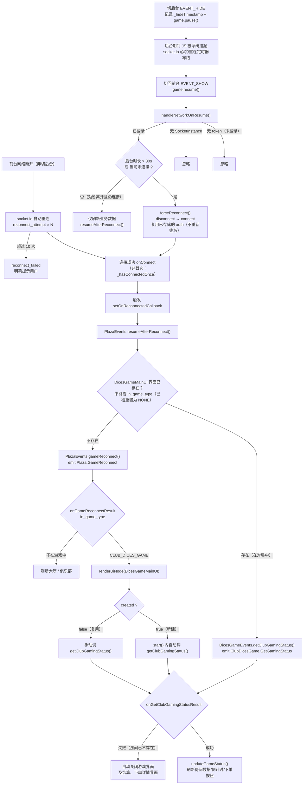

# 断线重连流程（切后台 / 回前台）

> 整理日期：2026-09-05
> 适用范围：真机切后台后回到前台的断线重连与房间数据恢复
> 涉及文件：`SocketManager.ts`、`BaseEvents.ts`、`PlazaEvents.ts`、`GameLanch.ts`

---

## 一、背景与问题

真机切后台一段时间再切回前台时，连接会失效。根因是**后台期间系统挂起 JS**，导致：

- socket.io 的**心跳与重连定时器全部冻结**；
- 极易残留 `connected === true` 但实际链路已死的**"假连接"**——socket.io 既不触发 `disconnect` 也不会自动重连。

因此不能依赖 socket.io 的自动重连，必须在回前台时**主动检测并重建**。

原链路存在以下缺陷（即本次修复对象）：

| # | 缺陷 | 后果 |
|---|------|------|
| 1 | 切回前台**没有任何重连逻辑**（`EVENT_SHOW` 仅 `game.resume()`） | 卡在"假连接"，连不上也无提示 |
| 2 | 重连成功后**不恢复业务数据**（`onReconnect` 只隐藏 loading） | socket 通了，但房间数据仍是旧的 |
| 3 | "已在游戏界面"分支里恢复房间数据的调用**被注释**（且指向 `DicesGameMainUI_Component` 上不存在的方法） | 复用界面时房间数据永不刷新 |
| 4 | `getClubGamingStatus()` 放在 `EVENT_PAUSE`（切后台瞬间） | 此刻网络即将中断，请求发不出也收不回 |

> **鉴权签名说明（关键）**：连接鉴权用 `CryptoUtils.genSignedParams({ token, time }, API_KEY)` 生成 `{ token, time, sign }`。
> 已对照后端 `gateway-service` 验证：`authenticate()` 仅做 `verifySignature({ token, time }, sign, API_KEY)`（用客户端传来的 `time` 重算 md5 比对）+ `checkToken(token)`，**不校验 `time` 的新鲜度**。
> 因此签名只要 `token` 有效即可**长期复用**，重连时由 socket.io 自动重发已存储的 `auth`，**无需每次重新签名**。客户端据此采用**静态 auth**（首次 `connect()` 生成一次）。

---

## 二、整体设计

两条触发入口，最终都汇入同一个业务恢复点，避免重复处理：

| 路径 | 触发 | 处理 |
|------|------|------|
| **A. 切后台回前台** | `EVENT_SHOW` → `handleNetworkOnResume()` | 后台超阈值(30s)或当前未连接则 `forceReconnect()` 强制重连；否则仅刷新业务数据 |
| **B. 前台网络波动** | socket.io 自动重连（`reconnect_attempt` × N） | 重连成功后走 `onConnect` 触发业务恢复 |

两条路径重连成功后**统一在 `onConnect` 内**触发 `resumeAfterReconnect()`（socket.io 重连成功时 `connect` 与 `reconnect` 都会触发，业务恢复只放一处去重，`onReconnect` 仅隐藏 loading）。

---

## 三、完整流程图

---

## 四、关键判定点

| # | 判定点 | 依据 |
|---|--------|------|
| 1 | 后台 > 30s **强制重连**，不信任 `isConnected()` | 规避"假连接"（TCP 已死但 `connected === true`，socket.io 不触发 `disconnect`） |
| 2 | 已在游戏界面 → **直接 `getClubGamingStatus()`**，不走 `gameReconnect` | 界面已存在即说明在对局中，直接拉房间状态最快 |
| 3 | **不用 `in_game_type` 判断是否在局** | `onGameReconnectResult` 末尾会把它重置为 `IN_GAME_TYPE.NONE`，二次重连会误判 |
| 4 | 业务恢复**只挂在 `onConnect`** | socket.io 重连成功时 `connect` 与 `reconnect` 都触发，放两处会重复请求 |
| 5 | `created === false` 时**手动拉状态** | 复用界面时 `start()` 不执行；原本这行被注释，导致房间数据不刷新 |
| 6 | 鉴权用**静态 auth**，重连自动重发 | 后端不校验 `time` 新鲜度，签名只要 `token` 有效即长期可用 |

---

## 五、涉及文件与改动

### 1. `assets/Scripts/Network/SocketIo/SocketManager.ts`

- 新增常量 `RECONNECTION_ATTEMPTS = 10`。
- socket 配置：`reconnection = true`、`reconnectionDelay = 1000`、`reconnectionDelayMax = 5000`、`reconnectionAttempts = RECONNECTION_ATTEMPTS`（超出触发 `reconnect_failed`，给用户明确提示）。
- 鉴权采用**静态对象**：
  - `connect()` 时用当前 token 生成一次 `SocketInstance.auth = genAuth()`；
  - `forceReconnect()` / 自动重连由 socket.io 自动重发已存储的 `auth`，**不重新签名**（后端不校验 `time` 新鲜度，签名可长期复用）；
  - 新增私有 `genAuth()`：`token` 读取用 `try/catch` 容错（可能不存在或格式异常），显式指定泛型避免 `unknown` 导致的 TS2345。
- `refleshToken()`：重新生成并赋值 `auth`（仅在 `token` 实际变化、如重新登录时调用）。
- 新增 `isConnected()`、`forceReconnect()`（`disconnect()` → `SocketInstance.connect()`，复用已存 `auth`）。

### 2. `assets/Scripts/Network/SocketIo/BaseEvents.ts`

- 新增 `_hasConnectedOnce`、`_onReconnectedCallback`、静态方法 `setOnReconnectedCallback()`。
- `onConnect`：非首次连接（`_hasConnectedOnce` 为 true，含自动重连与强制重连成功）触发业务恢复回调；末尾置 `_hasConnectedOnce = true`。
- `onReconnect`：仅隐藏 loading（业务恢复去重交给 `onConnect`）。
- `onDisconnect`：`ping timeout` / `transport error` / `transport close` / `default` 分支调 `refleshToken()` 刷新签名；`io server disconnect` 删除本地 token 并弹登录界面。

> 架构说明：基础层 `BaseEvents` **不直接 import 业务层**，改用回调钩子 `setOnReconnectedCallback`，由顶层 `GameLanch` 注册，避免 `BaseEvents → PlazaEvents → SocketManager → BaseEvents` 循环依赖。

### 3. `assets/Scripts/Network/SocketIo/PlazaEvents.ts`

- 新增 `resumeAfterReconnect()`：游戏界面已存在 → `DicesGameEvents.getClubGamingStatus()`；不存在 → `PlazaEvents.gameReconnect()`。
- `onGameReconnectResult` 的 `!created` 分支补上 `DicesGameEvents.getClubGamingStatus()`（复用界面时手动拉一次房间状态）。
- 末尾将 `currentPlayer.in_game_type` 重置为 `NONE`（故不能据此判断是否在对局）。

### 4. `assets/Scripts/GameLanch.ts`

- `onLoad` 注册 `BaseEvents.setOnReconnectedCallback(() => PlazaEvents.resumeAfterReconnect())`。
- 新增 `FORCE_RECONNECT_THRESHOLD = 30 * 1000` 与 `_hideTimestamp`。
- `EVENT_HIDE`：记录时间戳（回调用**箭头函数**，否则 `this` 非组件实例，时间戳写不进去）+ `game.pause()`。
- `EVENT_SHOW`：调用 `handleNetworkOnResume()`（先 `game.resume()`）。
- 新增 `handleNetworkOnResume()`：无 token / 无 SocketInstance 则忽略；后台 > 30s 或当前未连接 → `forceReconnect()`，否则 `resumeAfterReconnect()` 仅刷新业务。
- `EVENT_PAUSE`：移除时机错误的 `getClubGamingStatus()`（改由回前台连接恢复后统一拉取）。

---

## 六、可调参数

| 参数 | 位置 | 默认值 | 说明 |
|------|------|--------|------|
| `FORCE_RECONNECT_THRESHOLD` | `GameLanch.ts` | `30 * 1000`（30 秒） | 后台超过此值回前台即强制重连。调大减少无谓重连，调小更快摆脱"假连接" |
| `RECONNECTION_ATTEMPTS` | `SocketManager.ts` | `10` | 自动重连次数上限，超出触发 `reconnect_failed` |
| `reconnectionDelay` / `reconnectionDelayMax` | `SocketManager.ts` | `1000` / `5000` | 重连退避间隔与上限 |

---

## 七、真机验证清单

1. 切后台 **> 30 秒**回前台 → 应看到"强制重连"日志，随后自动恢复房间数据（倒计时、下单按钮、历史结果均正确）。
2. 切后台 **< 30 秒**回前台 → 只刷新业务数据，不发生重连。
3. 对局中切后台再回来 → 房间数据完整恢复，且**不会重复弹出游戏界面**。
4. 切后台期间房间被解散/玩家被踢 → 回前台后 `GetGamingStatus` 返回失败，自动关闭游戏界面与结算界面。
5. 断网后恢复 → 重连期间**不再弹窗轰炸**；超过 10 次后给出明确失败提示。
6. 退出登录 → 不应残留无法关闭的 loading。
